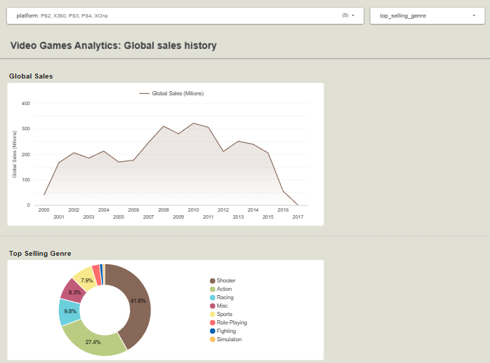

### 🇧🇷 Versão em Português

# 🎮 Video Games Sales Data Pipeline 
[](https://cloud.google.com/)
[](https://www.terraform.io/)
[](https://www.docker.com/)
[](https://airflow.apache.org/)
[](https://www.getdbt.com/)
[](https://cloud.google.com/bigquery)
[](https://lookerstudio.google.com/)

> Projeto final desenvolvido para o [Data Engineering Zoomcamp](https://github.com/DataTalksClub/data-engineering-zoomcamp) da DataTalks.Club.
>
> 🇺🇸 *[English version available here](./README.md)*

---

## ✅ Critérios de Avaliação (Peer Review)
Este projeto atende a todos os requisitos para o projeto final do Data Engineering Zoomcamp:

- [x] **Problem Description:** Definido claramente abaixo.
- [x] **Cloud:** Desenvolvido totalmente na nuvem (Google Cloud) estruturado com IaC (Terraform).
- [x] **Data Ingestion (Batch):** Pipeline automatizado usando Apache Airflow (Docker) para extrair dados do Kaggle para o Data Lake (GCS).
- [x] **Data Warehouse:** Tabelas no BigQuery com **Particionamento** (por ano) e **Clustering** (por plataforma).
- [x] **Transformations:** `dbt` utilizado para padronização, limpeza e agregações (camadas Silver e Gold).
- [x] **Dashboard:** Looker Studio com gráficos e filtros respondendo a perguntas de negócio.
- [x] **Reproducibility:** Instruções detalhadas passo a passo fornecidas abaixo.

---

## 📌 Tabela de Conteúdos
* [Sobre o Projeto](#-sobre-o-projeto)
* [Arquitetura e Tecnologias](#-arquitetura-e-tecnologias)
* [Data Warehouse (Otimizações)](#-data-warehouse-otimizações)
* [Dashboard Analítico](#-dashboard-analítico)
* [Estrutura do Repositório](#-estrutura-do-repositório)
* [Como Reproduzir o Projeto](#-como-reproduzir-o-projeto)

---

## 🎯 Sobre o Projeto

A indústria de videogames movimenta bilhões anualmente. Para publishers e desenvolvedores, entender tendências de vendas por região, gênero e plataforma é vital para o direcionamento de novos projetos.

Este projeto constrói um **Pipeline de Dados Ponta a Ponta** (End-to-End) que extrai o histórico global de vendas de videogames, carrega e processa essas informações na nuvem (GCP) e as disponibiliza em um Data Warehouse otimizado para consumo em um Dashboard analítico.

**Fonte de Dados:** [Video Game Sales Dataset (Kaggle)](https://www.kaggle.com/datasets/gregorut/videogamesales)

---

## 🏗️ Arquitetura e Tecnologias

O pipeline foi desenhado utilizando conceitos modernos de Engenharia de Dados:

1. **Infrastructure as Code (IaC):** `Terraform` para provisionamento do Data Lake e Data Warehouse no Google Cloud.
2. **Orquestração:** `Apache Airflow` rodando em containers `Docker` para ingestão dos dados (Data Lake).
3. **Data Lake:** `Google Cloud Storage (GCS)`.
4. **Data Warehouse:** `Google BigQuery`.
5. **Transformação (ELT):** `dbt (Data Build Tool)` para padronização, limpeza e agregação dos dados em camadas (Staging e Marts).
6. **Data Visualization:** `Google Looker Studio`.

---

## ⚙️ Data Warehouse (Otimizações)

Para garantir escalabilidade, performance nas consultas e redução de custos no BigQuery, a tabela final de Analytics (`marts_platform_yearly_sales`) foi otimizada utilizando as seguintes estratégias de modelagem implementadas nativamente via **dbt**:

* **Partitioning (Particionamento):** Por Ano de Lançamento (`release_year` convertido para `INT64`). Reduz o volume de dados escaneados em consultas temporais.
* **Clustering (Agrupamento):** Por Plataforma/Console (`platform`). Ordena os dados fisicamente dentro das partições para buscas ultra-rápidas por videogame.

---

## 📊 Dashboard Analítico

O produto final desta pipeline é um dashboard interativo no Looker Studio, desenvolvido para responder a perguntas de negócio como volume total de vendas globais, evolução temporal da indústria, ranking de plataformas e gêneros mais populares.

🔗 **[Acesse o Dashboard interativo ao vivo clicando aqui!](https://lookerstudio.google.com/reporting/67972fad-2a3b-4b47-b08c-64c265923d8d)**



---

## 📁 Estrutura do Repositório

```
DE-zoomcamp-project/
├── dbt/                    # Modelos SQL, macros e configurações do dbt
│   └── video_games_transform/
├── orchestration/          # Configurações do Airflow, DAGs e Docker Compose
│   ├── dags/
│   └── credentials/        # Pasta para a Service Account do GCP
├── terraform/              # Arquivos IaC (.tf) para provisionar GCS e BigQuery
├── .gitignore              # Arquivos a serem ignorados pelo Git
├── README.md               # Documentação do projeto
└── requirements.txt        # Dependências locais Python
```

## 🚀 Como Reproduzir o Projeto

Siga os passos abaixo para recriar esta infraestrutura no seu próprio ambiente.

### Pré-requisitos
* Conta ativa no Google Cloud Platform (GCP) e um Projeto criado.
* [Terraform instalado](https://developer.hashicorp.com/terraform/install).
* [Docker](https://docs.docker.com/get-started/get-docker/) e Dcoker Compose instaldos.
Credencias da API do Kaggle (```kaggle.json```)

# 1. Configuração do Repositório e Crendencias
Clone o repositório para a sua máquina local:
```
git clone [https://github.com/GPetrolini/DE-zoomcamp-project.git](https://github.com/GPetrolini/DE-zoomcamp-project.git)
cd DE-zoomcamp-project
```
## Credencias do GCP

### 1. Crie uma Service Account no GCP com permissões de Admin para Storage e BigQuery.

### 2.Gere a chave no formato JSON e salve-a como ```google_credentials.json``` dentro do diretório ```orchestration/credentials/```.

## Variáveis de Ambiente (.env):

Crie um arquivo ```.env``` dentro da pasta ```orchestration/``` e configure suas variáveis do Kaggle e GCP (substitua os valores de exemplo):

```
# orchestration/.env
KAGGLE_USERNAME=seu_usuario_kaggle
KAGGLE_KEY=sua_chave_secreta_kaggle
GCP_PROJECT_ID=de-zoomcamp-12345
GCP_GCS_BUCKET=seu_nome_de_bucket_unico
```
# 2. Provisionamento da Infraestrutura (Terraform)
Navegue até a pasta do Terraform para criar o Bucket (GCS) e o Dataset (BigQuery):

```
cd terraform
terraform init
terraform plan
terraform apply
```

# 3. Orquestração da Ingestão de Dados (Airflow)

```
cd ../orchestration
docker-compose up -d
```
* Acesse a UI do Airflow em http://localhost:8080.
* Habilite e rode a DAG responsável por buscar os dados no Kaggle e enviá-los ao GCS/BigQuery.

# 4. Transformação dos Dados (dbt)
Com os dados brutos no BigQuery, crie um ambiente virtual Python, instale as dependências locais e rode as transformações do dbt:

```
cd ../
python -m venv .venv
source .venv/bin/activate  # ou .venv\Scripts\activate no Windows
pip install -r requirements.txt

cd dbt/video_games_transform
dbt deps
dbt run --full-refresh
```
Após o ```dbt run```, suas tabelas da camada Silver (Staging) e Gold (Marts) estarão particionadas, clusterizadas e prontas para o Looker Studio no seu BigQuery!
